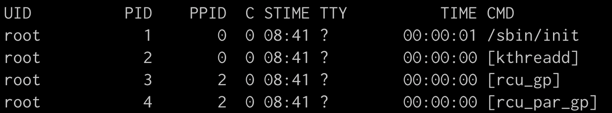
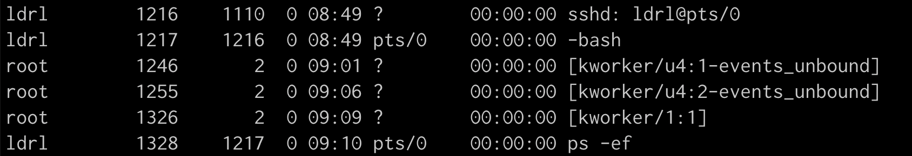
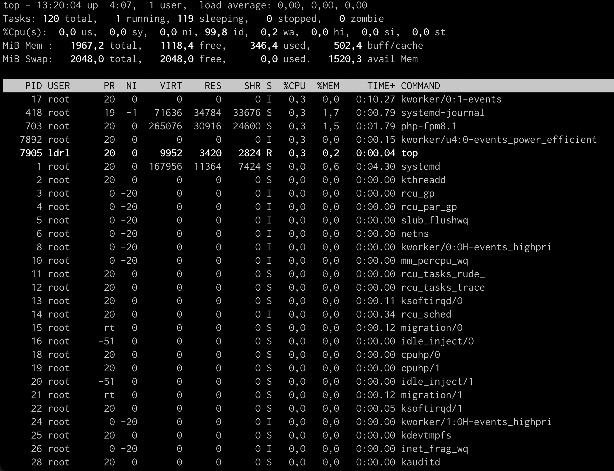
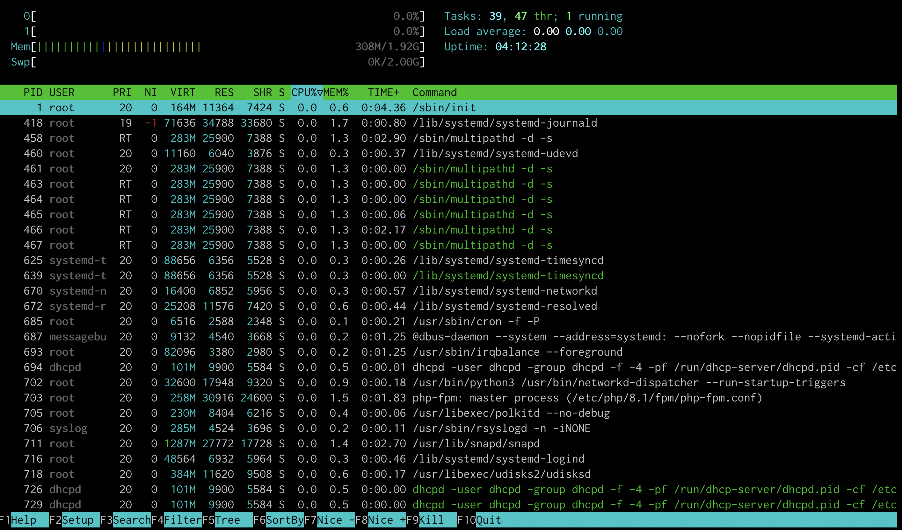
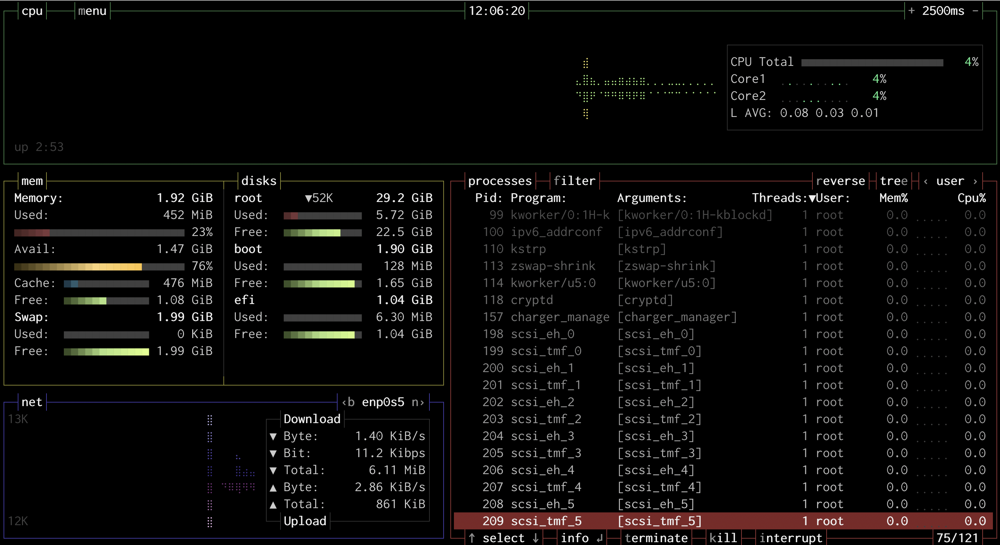

# Monitoring 101 👀

[See the monitoring report exercise](./lets_monitor_our_shit.md)

**Table of contents**
- [Monitoring 101](#monitoring-101)
  - [Learning goals](#learning-goals)
    - [Questions to answer](#questions-to-answer)
  - [Processor and processes](#processor-and-processes)
  - [Linux system monitoring tools](#linux-system-monitoring-tools)
  - [Log files](#log-files)
    - [rsyslog](#rsyslog)
    - [Resources](#resources)
  - [Users connections and activity](#users-connections-and-activity)
    - [/var/log/auth.log](#varlogauthlog)
    - [`last`](#last)
    - [`lastlog`](#lastlog)
    - [`who` and `w`](#who-and-w)
    - [Resources](#resources-1)
  - [Network activity](#network-activity)
    - [`ss`](#ss)
  - [For next project](#for-next-project)

## Learning goals

+ How to monitor a Linux system 
+ What to look for ?

### Questions to answer
+ What are the main area of concern when monitoring a system? (EX: CPU load, disk usage, ...)
+ How can you check what are the most memory intensive running processes ?
+ What are log files? Where can you find them on a typical Linux system ?
+ How can you check who where the last connected users, what they did, when they left ?
+ What are the different metrics of health and performance of a system ?
+ How can you check the uptime of a machine ?
+ How can you assess the network traffic ?

---

What are the main area of concern when monitoring a system? What processes are running on a system at a given moment ?
Which user ran which commands ? 
How much of the CPU and memory are the processes taking ?

## Processor and processes

What is a process ?

### `ps`

The command `ps` allows us to see all processes running in a system.  
We can also sort the results by users, CPU load, memory used...

**Displays active processes**
`ps` 

**Display all processes in the system**
_Not only the processes started by a user or in a terminal session, but also those launched by the system_
`ps -e`

**Displays more information about the process**
`ps -ef` 

**PID**: proces ID
**PPID**: parent process ID
🚧 **C**
🚧 **TTY**
🚧 **CMD**

**ps -ef outputs**
We can see here that the first process is `/sbin/init`, it's the process in charge of **booting** our server.

We can see that TTY value is **pts/0**, which stands for pseudo terminal #0.
It is the terminal session that I started via ssh from my main machine on which I connected to ssh to the server.
We can see that we run the command `ps -ef` from this terminal. 

**tty1** is a session on the system's first virtual console, possibly accessed directly from the machine's physical input and output devices.

[More about pts and tty](https://www.baeldung.com/linux/pty-vs-tty)

**Filter by user**
`ps -edf | grep <user>`

**Display the 5 most memory intensive processes** 
`ps -edf --sort=+pmem | tail -5`

**Display the 5 most cpu demanding processes** 
`ps -edf --sort=+pcpu | tail -5`

### `top`, `htop`...

### `top`
The `top` command displays linux processes in CPU activity order.  
It is installed by default on a lot of distributions.
It is the equivalent of the task manager in Windows system.
Press `h` to have the documentation

**But `top` is not very user-friendly.**

### `htop`  
`htop` is a more user friendly `top`, it might not installed by default.

### `bashtop`

`bashtop` is a linux monitoring tool.
Here is the [github repository](https://github.com/aristocratos/bashtop).
It looks much nicer than top and htop.

## Log files

We can find the logs of a linux system in the directory /var/log.

### rsyslog

**rsyslog** is the service responsible for handling logs in Ubuntu.
rsyslog configuration is in the file /etc/rsyslog.conf

`grep "/var/log" /etc/rsyslog.conf`

Centralize logs of several machines on one server

On my ubuntu vm-client, I just have the folder /etc/rsyslog.d 
On my ubuntu server, I have the file /etc/rsyslog.conf and the folder /etc/rsyslog.d 

### Resources
FR: [Analysez les principaux fichiers de traces](https://openclassrooms.com/fr/courses/7274161-administrez-un-systeme-linux/7529366-analysez-les-principaux-fichiers-de-traces)
FR: [Centralisation des logs sous linux](https://www.linuxtricks.fr/wiki/rsyslog-centralisation-des-logs-sous-linux)

## Users connections and activity
*How can you check who where the last connected users, what they did, when they left ?*

### /var/log/auth.log

### `last`

The last command pulls its data from /var/log/wtmp.  
The file /var/log/wtmp is updated each time a user logs in.   
It'll show username, tty, IP address, date and time, and session start/stop times.  

### `lastlog`

With the command `lastlog`, we can see _when_ each user last logged in.  
Those information comes from the file `/etc/log/lastlog` They are sorted based on the user entries from the file /etc/password entries.  

**To see last login of root user**  
`lastlog -u root`

An attacker with access to root can modify or delete the authentication logs.  
The absence of authentication logs can be suspect.

### `who` and `w`
With the command `who` we can see which user is connected, we can also see the date of the last reboot.  

🚧 The `w` command...

### Resources
[How to view authentication logs on Ubuntu](https://bitlaunch.io/blog/how-to-view-authentication-logs-on-ubuntu-20-04/)

## Network activity

### `ss`  
`ss -lptun` = modern replacement to `netstat`  
`ss` stands for socket statistics  

🚧 **explain what a socket is**

## For next project

https://www.it-connect.fr/linux-recevoir-un-e-mail-lors-dune-connexion-ssh/

## test